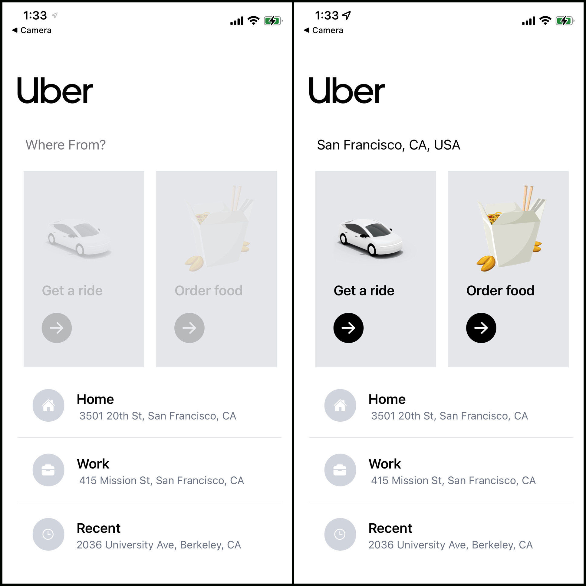
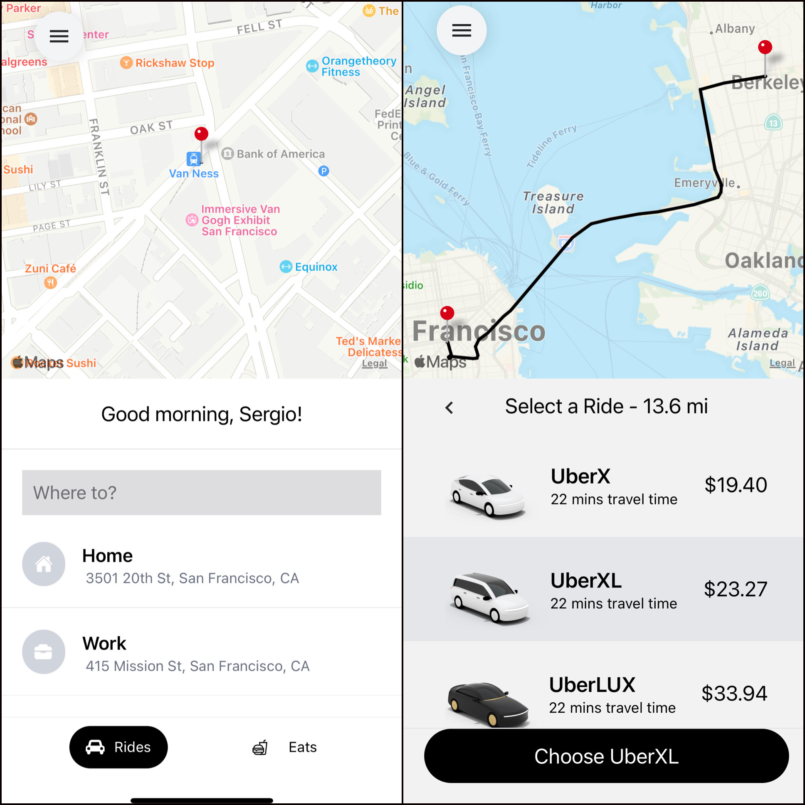

✏️ Description:

En utilisant React Native, j'ai construit une application Uber.
en utilisant les API Google, notamment les lieux, les directions et la matrice de distance(Distance Matrix) pour calculer le temps de trajet, la distance, le coût et en navigation réelle.

🛠 Technnologies Utiliser:

Language: 
  - JavaScript

Front-End:
  - React Native
  - React Redux
  - Tailwind CSS

Back-End:
  - Node.js
  - Expo
  - Google API's

Fonctionnelle:
- Get a Ride
  - Entrez l'emplacement et sélectionnez dans la saisie Google auto-complete
  - Calcule du temps, la distance et le coût du trajet.

Non-Fonctionnelle:
- Order-Food
- Domicile, travail et emplacements récents

Instructions: 
1) Sur l'écran d'accueil, entrez votre emplacement de départ
2) Selectionner 'Get a Ride' (devient cliquable après avoir entré l'emplacement)
3) Entrez votre destination
4) sélectionnez votre trajet (met en évidence votre choix et rend le bouton « Choisir » cliquable avec votre choix actuel.)

